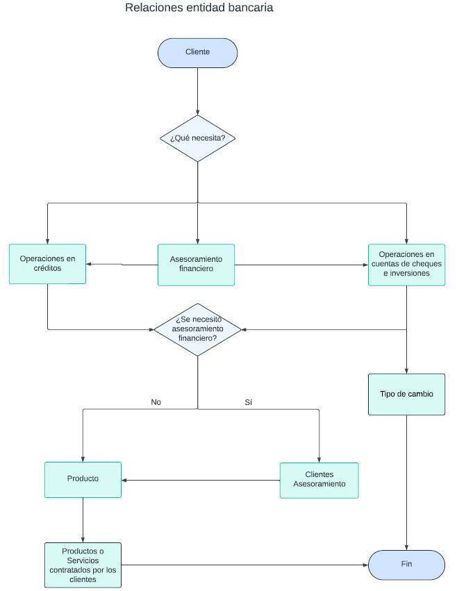
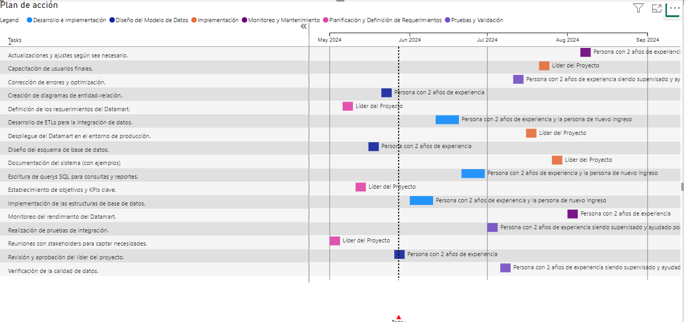
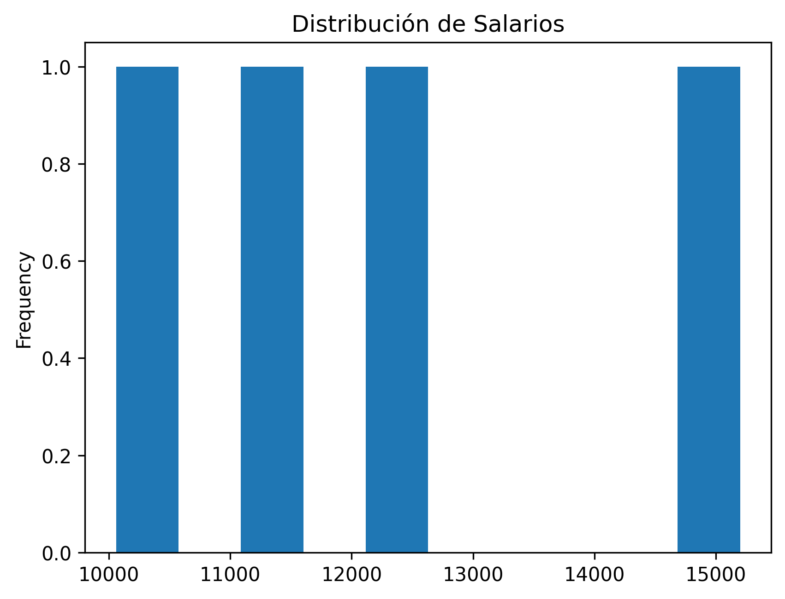
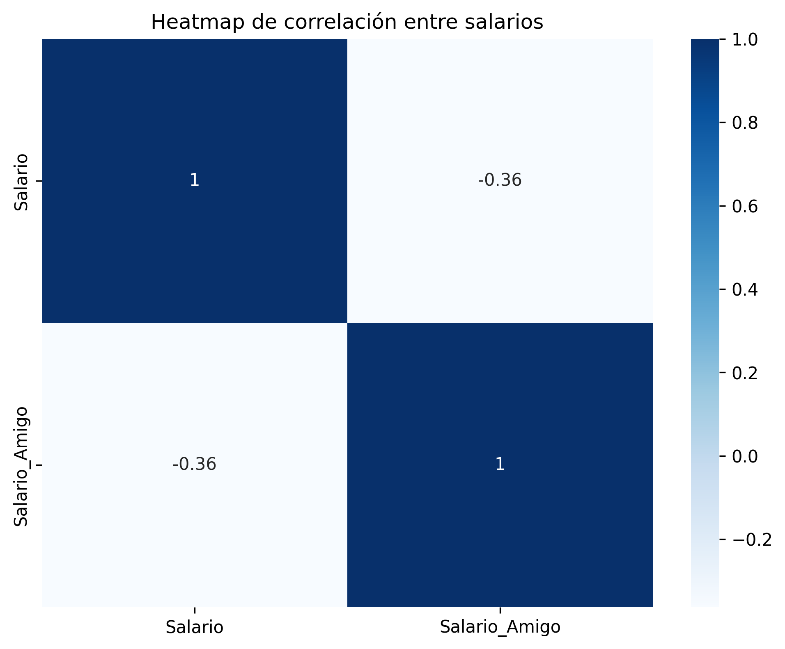
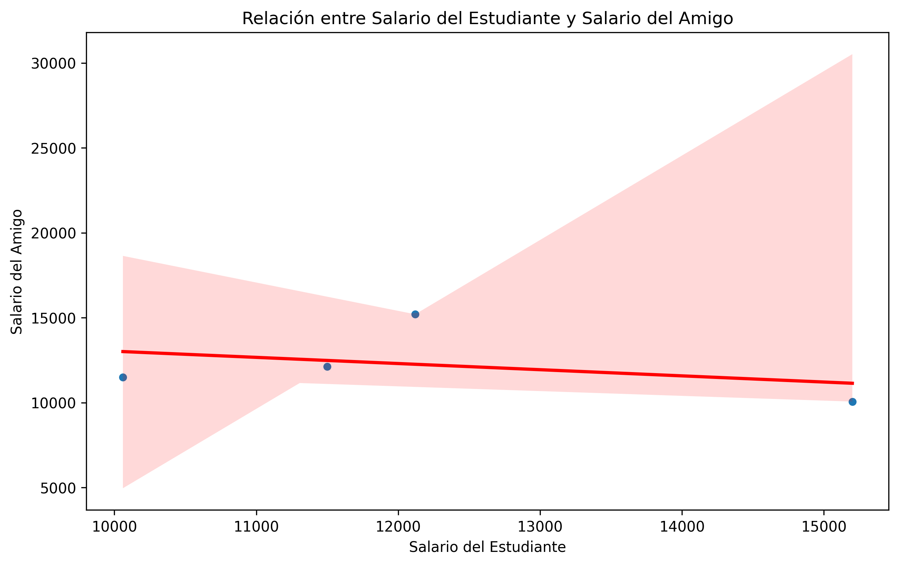

1) De las 3 tablas anexas, escribe una consulta que te de los nombres de aquellos estudiantes cuyos amigos perciben un ingreso mayor que ellos. Los nombres deben de estar ordenados por el salario que ganan sus amigos.

### Tabla Amigos
| ID | Amigo_ID |
|----|----------|
| 1  | 2        |
| 2  | 3        |
| 3  | 4        |
| 4  | 1        |

### Tabla Estudiantes
| ID | Nombre |
|----|--------|
| 1  | Manuel |
| 2  | Tania  |
| 3  | Pedro  |
| 4  | Ana    |

### Tabla Salario
| ID | Salario    |
|----|------------|
| 1  | $15,200.10 |
| 2  | $10,060.20 |
| 3  | $11,500.50 |
| 4  | $12,120.00 |

Salida Datos

Tania
Pedro
Ana

[Ver Exercise 1](./Exercise1/)

2)	Una Institución Bancaria quiere implementar en el área de Riesgos un Datamart para atender las necesidades de información del área, tu como experto, ¿cómo llevarías a cabo el desarrollo e implementación del Datamart? Considera que a tu cargo tienes 2 personas y una persona es de nuevo ingreso y la otra tiene 2 años en el equipo. Desarrolla un Datamart anexando los scripts que emplearías y atiende las preguntas:

    a) ¿Qué es un Datamart explicado en tus palabras? Es una versión simplificada y más enfocada de un data warehouse, diseñada específicamente para satisfacer las necesidades de análisis de datos de un departamento específico o área funcional de una organización. A diferencia de un data warehouse que contiene datos integrados de toda la empresa, un datamart se limita a temas específicos, facilitando un acceso más rápido y eficiente a los datos relevantes. Se puede considerar como un subconjunto del data warehouse principal, optimizado para un grupo particular de usuarios o funciones de negocio.

    b) Desarrolla las tablas del Datamart (puedes añadir algún elemento visual con las relaciones de las tablas). Tienes que desarrollar las tablas en función de las siguientes Dimensiones/Catálogos y construirlas en base a la información que crees estas pudieran contener: Clientes, Productos que oferta el Banco, Tipo de cambio. Adicionalmente cuentas con las siguientes tablas operativas: Productos o Servicios contratados por los clientes, Operaciones de las cuentas de cheques e inversiones, Operaciones de los créditos de los clientes.

    

    [Ver Exercise 2](./Exercise2/)

    c) ¿Cuál es la relación que existe entre las tablas? (Ej. una a muchas, muchas a muchas, muchas a una) Específica la relación que guarda cada tabla con las demás.

    | Tabla | Tipo de Relación | Descripción |
    |--------------------------------------------------|-------------------|-----------------------------------------------------------------------------------------------------|
    | Clientes a Productos                             | Muchos a Muchos   | Un cliente puede contratar múltiples productos y un producto puede ser contratado por múltiples clientes. |
    | Productos a Productos o Servicios contratados    | Uno a Muchos      | Un producto puede ser contratado en varias transacciones.                                           |
    | Clientes a Operaciones en cuentas de cheques     | Uno a Muchos      | Un cliente puede realizar múltiples operaciones.                                                    |
    | Operaciones en cuentas de cheques a Tipo de Cambio | Muchos a Uno    | Múltiples operaciones pueden utilizar el mismo tipo de cambio registrado en una fecha específica.    |
    | Operaciones en cuentas de cheques a Asesoramiento Financiero | Muchos a Uno | Varias operaciones pueden estar asociadas con un solo asesoramiento financiero.                     |
    | Operaciones en cuentas de cheques a Productos    | Muchos a Uno      | Múltiples operaciones pueden estar relacionadas con un solo producto.                                |
    | Operaciones en crédito a Clientes                | Muchos a Uno      | Múltiples operaciones pueden estar vinculadas a un solo cliente.                                     |
    | Operaciones en crédito a Productos               | Muchos a Uno      | Múltiples operaciones de crédito pueden involucrar el mismo producto.                                |
    | Operaciones en crédito a Asesoramiento Financiero | Muchos a Uno     | Múltiples operaciones de crédito pueden estar asociadas a un solo asesoramiento financiero.          |
    | Clientes Asesoramiento a Clientes                | Muchos a Uno      | Varios registros de asesoramiento pueden estar asociados a un solo cliente.                         |
    | Clientes Asesoramiento a Asesoramiento Financiero | Muchos a Uno     | Varios registros de asesoramiento de clientes pueden referirse al mismo asesoramiento financiero.   |
    | Clientes Asesoramiento a Productos               | Muchos a Uno      | Varios registros de asesoramiento de clientes pueden involucrar el mismo producto.                   |

    d) ¿Qué llaves primarias y secundarias tienen las tablas? Anexa los scripts de cada una de las tablas y en caso de que identifiques alguna que no aplica para esto, ¿qué lo justifica?

    | Nombre de la Tabla                                  | Tipo de Llave       | Script | Justificación de Tipo de Llave                                                       |
    |-----------------------------------------------------|---------------------|--------|-------------------------------------------------------------------------------------|
    | Asesoramiento Financiero                            | Primaria            | CREATE TABLE [Asesoramiento Financiero] (AsesoramientoID INT PRIMARY KEY,[Plan financiero] NVARCHAR(MAX)); | Identificador único para cada asesoramiento.                                        |
    | Clientes                                            | Primaria            | CREATE TABLE [Clientes] (ClienteID INT PRIMARY KEY,Nombre NVARCHAR(255),Direccion NVARCHAR(255),Telefono NVARCHAR(50)); | Identificador único para cada cliente.                                              |
    | Productos                                           | Primaria            |   CREATE TABLE [Productos] (ProductoID INT PRIMARY KEY,Nombre NVARCHAR(255),Tipo NVARCHAR(50),Categoria NVARCHAR(50));     | Identificador único para cada producto.                                             |
    | Tipo de Cambio                                      | Primaria            |  CREATE TABLE [Tipo de Cambio] ([Fecha de operacion] DATE PRIMARY KEY,[Tasa de cambio] FLOAT,[Moneda de origen] NVARCHAR(3),[Moneda de destino] NVARCHAR(3));  | Fecha única que identifica un tipo de cambio específico.                             |
    | Productos o Servicios contratados por los clientes  | Primaria, Secundaria|  CREATE TABLE [Productos o Servicios contratados por los clientes] (TransaccionID INT PRIMARY KEY,ClienteID INT,ProductoID INT,Cantidad INT,[Fecha de contratacion] DATE,[Valor de transaccion] FLOAT,FOREIGN KEY (ClienteID) REFERENCES [Clientes](Cliente ID),FOREIGN KEY (ProductoID) REFERENCES [Productos] (ProductoID)); | Transacción única; cada transacción está ligada a un cliente y un producto.          |
    | Operaciones en cuentas de cheques e inversiones     | Primaria, Secundaria|  CREATE TABLE [Operaciones en cuentas de cheques e inversiones] (OperacionID INT PRIMARY KEY,ClienteID INT,Monto FLOAT,AsesoramientoID INT NULL,ProductoID INT NULL,[Fecha de operacion] DATE,[Tipo de operacion] NVARCHAR(50),FOREIGN KEY (ClienteID) REFERENCES [ Clientes ](ClienteID),FOREIGN KEY ([Fecha de operacion]) REFERENCES [Tipo de Cambio]([Fecha de operacion]),FOREIGN KEY (AsesoramientoID) REFERENCES [Asesoramiento Financiero(AsesoramientoID),FOREIGN KEY (ProductoID) REFERENCES [Productos](ProductoID));      | Operación única; vinculada a cliente, tipo de cambio, producto, y asesoramiento opcional. |
    | Operaciones en crédito                              | Primaria, Secundaria| CREATE TABLE [Operaciones en crédito] (CreditoID INT PRIMARY KEY,ClienteID INT,ProductoID INT,AsesoramientoID INT NULL,[Fecha de credito] DATE,[Monto de credito] FLOAT,[Estado de credito] NVARCHAR(50),FOREIGN KEY (ClienteID) REFERENCES [Clientes](ClienteID),FOREIGN KEY (ProductoID) REFERENCES [Productos](ProductoID),FOREIGN KEY (AsesoramientoID) REFERENCES [Asesoramiento Financiero](AsesoramientoID));| Operación de crédito única; vinculada a un cliente, producto y asesoramiento opcional. |
    | Clientes Asesoramiento                              | Primaria, Secundaria| CREATE TABLE [Clientes Asesoramiento] (ClienteID INT,AsesoramientoID INT,ProductoID INT,PRIMARY KEY (ClienteID, AsesoramientoID),FOREIGN KEY (ClienteID) REFERENCES [Clientes](ClienteID),FOREIGN KEY (AsesoramientoID) REFERENCES [Asesoramiento Financiero](AsesoramientoID),FOREIGN KEY (ProductoID) REFERENCES [Productos](ProductoID));       | Relación muchos a muchos entre clientes y asesoramientos, con producto opcional.    |

    e) Identifica y señala en cada tabla los controles que establecerías para alimentar de información correcta, íntegra, precisa y confiable a las tablas (Ej. valores no nulos, cuadre de cifras, etc.).

    Asesoramiento Financiero:

        AsesoramientoID y Plan financiero: no acepten valores nulos
        Plan financiero: Se propone hacer una validación de datos y siguiendo un formato estandarizado. Se propone hacer una funcion en Python que valida el tipo de datos y su consistencia.

    Clientes:

        Todos los campos deberán ser no nulos para asegurar que la información del cliente está completa.
        Se propone validar que Telefono cumpla con un formato adecuado y válido.

    Productos:

        Todos los campos debrán ser no nulos para asegurar que la información del producto este completa.
        Se verfica que Tipo y Categoria sean adecuados dentro de un estandar. Esto es, que los campos ingresados esten dentro de una lista disponible de productos.

    Tipo de cambio:

        Valores no nulos entre todos los campos.
        Se verifica que el tipo de moneda este dentro de una lista de monedas disponibles y que la tasa de cambio sea un valor flotante.

    Producto o servicios contratados por los clientes:

        Valores no nulos en todos los campos para garantizar registros completos.
        Se verifica que las fechas y valores monetarios sean validos. Asi mismo, cantidad deberá ser un numero entero positivo.

    Operaciones en cuentas de cheques e inversiones:

        Todos los campos deberán ser no nulos a excepecion de AsesoramientoID y productoID, ya que estos 2 son opcionales en esta tabla.
        Se verifica que Monto sea un valor positivo y flotante. Acdemás, tipo de operación sea disponible dentro de un conjunto válido.

    Operaciones en crédito:

        Todos los campos deben ser no nulos a excepción de AsesoramientoID por ser opcional.
        Monto de crédito y fecha de crédito son validados, además estado de cuenta cumpla con un criterio dado (Activo, Pendiente,Cancelado etc)

    Clientes Asesoramiento:

        Valores no nulos en ClienteID,AsesoramientoID,ProductoID.
        Se verifica que cada ID correspondiente este asociado a un registro válido

    f) Desarrolla consultas que podrías realizar para establecer la relación entre las distintas tablas.

    | Tabla| Query | Objetivo   |
    |------------------------------------------------------|--------------------------------------------------------------------------------------------------------------------------------------------------------------------------------------------------------------------------------------------------------------------------------|------------------------------------------------------------------------------------------------------------|
    | Clientes   | SELECT p.Nombre, p.Tipo, p.Categoria, pc.[Fecha de contratacion], pc.[Valor de transaccion] FROM [Clientes] c JOIN [Productos o Servicios contratados por los clientes] pc ON c.ClienteID = pc.ClienteID JOIN [Productos] p ON pc.ProductoID = p.ProductoID WHERE c.Nombre = 'Nombre del Cliente';` | Mostrar los productos específicos que un cliente ha contratado.                                            |
    | Asesoramientos Financieros  | SELECT c.Nombre, af.[Plan financiero], p.Nombre AS 'Producto Asociado' FROM [Clientes] c JOIN [Clientes Asesoramiento] ca ON c.ClienteID = ca.ClienteID JOIN [Asesoramiento Financiero] af ON ca.AsesoramientoID = af.AsesoramientoID JOIN [Productos] p ON ca.ProductoID = p.ProductoID WHERE c.ClienteID = 1;` | Listar los asesoramientos financieros que un cliente ha recibido, incluyendo los productos asociados.      |
    | Operaciones de crédito | SELECT oc.CreditoID, c.Nombre, oc.[Fecha de credito], oc.[Monto de credito], oc.[Estado de credito], af.[Plan financiero] FROM [Operaciones en crédito] oc LEFT JOIN [Clientes] c ON oc.ClienteID = c.ClienteID LEFT JOIN [Asesoramiento Financiero] af ON oc.AsesoramientoID = af.AsesoramientoID;` | Detallar las operaciones de crédito por cliente, incluyendo el plan financiero si está disponible.          |
    | Operaciones en cuentas de cheques | SELECT oci.OperacionID, oci.[Tipo de operacion], oci.Monto, tc.[Tasa de cambio], tc.[Moneda de origen], tc.[Moneda de destino] FROM [Operaciones en cuentas de cheques e inversiones] oci JOIN [Tipo de Cambio] tc ON oci.[Fecha de operacion] = tc.[Fecha de operacion] WHERE tc.[Fecha de operacion] = '2021-01-01';` | Mostrar operaciones en cuentas de cheques que involucren cambios de moneda en una fecha específica.         |
    | Operaciones en crédito | SELECT c.Nombre, oc.[Estado de credito], p.Nombre AS 'Producto Asociado' FROM [Operaciones en crédito] oc JOIN [Clientes] c ON oc.ClienteID = c.ClienteID JOIN [Productos] p ON oc.ProductoID = p.ProductoID WHERE oc.[Estado de credito] = 'Activo';` | Identificar clientes con créditos activos y los productos asociados a dichos créditos.                     |

    g) Si la información a cargar proviene de un archivo de texto ¿Qué características debe de tener este para poder subir la información a la base de datos?

    | Característica | Descripción |
    |--------------------------------------|-----------------------------------------------------------------------------------------------------------------------------------------------------------------|
    | Formato Consistente                  | El archivo debe  ser un CSV para simplicidad y compatibilidad.|
    | Codificación de Caracteres           | La codificación debe ser compatible, generalmente UTF-8, para soportar un amplio rango de caracteres.|
    | Encabezados Claros                   | Debe incluir encabezados en la primera línea que correspondan o puedan mapearse a las columnas en la base de datos. |
    | Formato de Datos Correcto            | Los datos deben estar en el formato esperado por la base de datos, como fechas en formato D/M/A y números con el formato decimal adecuado (Preferentemente con decimales no mayores a una cantidad establecida) |
    | Valores Nulos                        | Debe manejar correctamente los valores nulos, usando un indicador consistente como un campo vacío.|
    | Escape de Caracteres Especiales      | Caracteres que podrían interpretarse como especiales en SQL deben estar correctamente manejados.|
    | Sin Filas Duplicadas                 | El archivo no debe contener filas duplicadas, a menos que se permitan explícitamente, para evitar inconsistencias.|
    | Tamaño de Archivo Manejable          | El tamaño del archivo debe ser adecuado para las capacidades del sistema de gestión de base de datos y el proceso de importación.                                |
    | Cumplimiento de Restricciones        | El archivo debe respetar las restricciones de integridad de la base de datos, incluyendo claves primarias, claves foráneas, y restricciones de unicidad y chequeo (Las columnas a mapear como llaves primarias, en el csv no pueden incuplir sus principios)|

    h) Si requieres actualizar información, partiendo de las tablas que desarrollaste, ¿Que código emplearías?

    | Tabla| Código de actualización de tabla |
    |-----------------------------------------------------|------------------------------------------------------------------------------------------------------------------|
    | Clientes                                            | UPDATE Clientes SET Nombre = 'Nuevo Nombre', Direccion = 'Nueva Dirección' WHERE ClienteID = 1;|
    | Productos                                           | UPDATE Productos SET Nombre = 'Nuevo Producto', Tipo = 'Nuevo Tipo' WHERE ProductoID = 1;|
    | Tipo de Cambio                                      | UPDATE Tipo de Cambio SET Tasa de cambio = 1.25 WHERE Fecha de operacion = '2021-01-01';|
    | Productos o Servicios contratados por los clientes  | UPDATE Productos o Servicios contratados por los clientes SET Cantidad = 10 WHERE TransaccionID = 1;|
    | Operaciones en cuentas de cheques e inversiones     | UPDATE Operaciones en cuentas de cheques e inversiones SET Monto = 200.00 WHERE OperacionID = 1;|
    | Operaciones en crédito                              | UPDATE Operaciones en crédito SET Monto de credito = 5000.00, Estado de credito = 'Pagado' WHERE CreditoID = 1;|
    | Asesoramiento Financiero                            | UPDATE Asesoramiento Financiero SET Plan financiero = 'Plan Revisado' WHERE AsesoramientoID = 1; |

    i) Si requieres borrar información, partiendo de las tablas que desarrollaste, ¿Que código emplearías?

    | Tabla| Código para borrar tabla |
    |-----------------------------------------------------|-------------------------------------------------------------------------------------------------------------------|
    | Clientes                                            | DELETE FROM Clientes WHERE ClienteID = 1;|
    | Productos                                           | DELETE FROM Productos WHERE ProductoID = 1;|
    | Tipo de Cambio                                      | DELETE FROM Tipo de Cambio WHERE Fecha de operacion = '2021-01-01';|
    | Productos o Servicios contratados por los clientes  | DELETE FROM Productos o Servicios contratados por los clientes WHERE TransaccionID = 1;|
    | Operaciones en cuentas de cheques e inversiones     | DELETE FROM Operaciones en cuentas de cheques e inversiones WHERE OperacionID = 1;|
    | Operaciones en crédito                              | DELETE FROM Operaciones en crédito WHERE CreditoID = 1;|
    | Asesoramiento Financiero                            | DELETE FROM Asesoramiento Financiero WHERE AsesoramientoID = 1;|

    j) Si requieres eliminar una tabla, partiendo de las tablas que desarrollaste, ¿Que código emplearías?

    | Tabla| Código para eliminar tabla |
    |-----------------------------------------------------|-----------------------------------------------------------------|
    | Clientes Asesoramiento                              | DROP TABLE Clientes Asesoramiento;|
    | Operaciones en crédito                              | DROP TABLE Operaciones en crédito;
    | Operaciones en cuentas de cheques e inversiones     | DROP TABLE Operaciones en cuentas de cheques e inversiones;|
    | Productos o Servicios contratados por los clientes  | DROP TABLE Productos o Servicios contratados por los clientes;|
    | Asesoramiento Financiero                            | DROP TABLE Asesoramiento Financiero;|
    | Productos                                           | DROP TABLE Productos;|
    | Clientes                                            | DROP TABLE Clientes;|
    | Tipo de Cambio                                      | DROP TABLE Tipo de Cambio;|

    k) Si requieres particionar una tabla, partiendo de las tablas que desarrollaste, ¿Que código emplearías?

    Supongamos que se quiere particionar la tabla [Operaciones en cuentas de cheques e inversiones] por la fecha de operación, para optimizar el acceso a los datos y mejorar la administración de las operaciones históricas. Entonces podemos seguir de la siguiente manera:

    1) Definir el rango de fechas que determinará cómo se particionarán los datos:

            CREATE PARTITION FUNCTION particion_OperacionesFecha (DATE) AS RANGE RIGHT FOR VALUES ('2020-01-01', '2021-01-01', '2022-01-01');

    2) Crear un esquema de partición para especificar el almacenamiento físico de cada partición en el sistema de archivos.

            CREATE PARTITION SCHEME particion_OperacionesFecha
            AS PARTITION particion_OperacionesFecha
            TO ([PRIMARY], [PRIMARY], [PRIMARY], [PRIMARY]);

    3) Crear o modificar la tabla para utilizar el particionamiento (Si ya existe la tabla y tiene datos, se crea una nueva tabla con la distribucion deseada y se transfieren los datos. Si la tabla es nueva se crea con la partición hecha)

            CREATE TABLE [Operaciones en cuentas de cheques e inversiones] (
            OperacionID INT PRIMARY KEY,
            ClienteID INT,
            Monto FLOAT,
            AsesoramientoID INT NULL,
            ProductoID INT NULL,
            [Fecha de operacion] DATE,
            [Tipo de operacion] NVARCHAR(50),
            FOREIGN KEY (ClienteID) REFERENCES [Clientes](ClienteID),
            FOREIGN KEY ([Fecha de operacion]) REFERENCES [Tipo de Cambio]([Fecha de operacion]),
            FOREIGN KEY (AsesoramientoID) REFERENCES [Asesoramiento Financiero](AsesoramientoID),
            FOREIGN KEY (ProductoID) REFERENCES [Productos](ProductoID)) ON particion_OperacionesFecha([Fecha de operacion]);

    l) Si requieres eficientar la consulta de información recurrente a una tabla, partiendo de las tablas que desarrollaste, ¿Que código emplearías?

    Una tecnica usual es utilizar indices para ayudar a la recuperación de datos sin necesidad de escanear o revisar toda la tabla (En bases de datos grandes muy útil)

    Supongamos que la tabla [Operaciones en cuentas de cheques e inversiones] es frecuente, especialmente filtrando por ClienteID o por Fecha de operacion.

        a) Por ClienteID:
        CREATE INDEX idx_ClienteID ON [Operaciones en cuentas de cheques e inversiones](ClienteID);

        b) Por [Fecha de operacion]:
        CREATE INDEX idx_FechaOperacion ON [Operaciones en cuentas de cheques e inversiones]([Fecha de operacion]);

    m) ¿Cómo organizarías al equipo para cumplir el objetivo considerando su experiencia laboral? Elabora un Plan de acción para ejecutar cada una de las etapas junto con sus responsables (puede ser un diagrama de gantt).

    Líder del Proyecto [Yo, Jorge Portilla]: Encargado de la gestión general del proyecto (Planificación de infraestructura, políticas de seguridad y acceso a bases de datos), definición de objetivos siguiendo la estructura del datamart ya conceptualizado anteriormente.

    Persona con 2 años de experiencia: Responsable del diseño técnico (extracción y carga de datos), desarrollo de consultas complejas y supervisión de la persona de nuevo ingreso.

    Persona de nuevo ingreso: Apoyo en tareas de desarrollo más sencillas, pruebas y documentación que dejen más claro el proceso que lleva a cabo el Datamart.

    Plan de Acción:

        1. Planificación y Definición de Requerimientos
        Responsable: Líder del Proyecto
        Tareas:
            - Reuniones con stakeholders para captar necesidades.
            - Definición de los requerimientos del Datamart.
            - Establecimiento de objetivos y KPIs clave.

        2. Diseño del Modelo de Datos
        Responsable: Persona con 2 años de experiencia
        Tareas:
            - Diseño del esquema de base de datos.
            - Creación de diagramas de entidad-relación.
            - Revisión y aprobación del líder del proyecto.

        3. Desarrollo e Implementación
        Responsable: Persona con 2 años de experiencia y la persona de nuevo ingreso.
        Tareas:
            - Implementación de las estructuras de base de datos.
            - Desarrollo de ETLs para la integración de datos.
            - Escritura de querys SQL para consultas y reportes.

        4. Pruebas y Validación
        Responsable: Persona con 2 años de experiencia siendo supervisado y ayudado por el lider del proyecto
        Tareas:
            - Realización de pruebas de integración.
            - Verificación de la calidad de datos.
            - Corrección de errores y optimización.

        5. Implementación
        Responsable: Líder del Proyecto
        Tareas:
            - Despliegue del Datamart en el entorno de producción.
            - Capacitación de usuarios finales.
            - Documentación del sistema (con ejemplpos)

        6. Monitoreo y Mantenimiento
        Responsable:Persona con 2 años de experiencia.
        Tareas:
            - Monitoreo del rendimiento del Datamart.
            - Actualizaciones y ajustes según sea necesario.

    Herramientas de Gestión:
        Herramientas de seguimiento de tareas:
        JIRA para asignar y monitorear el progreso de las tareas. [Información sobre JIRA](https://www.atlassian.com/es/software/jira/guides/getting-started/who-uses-jira#for-agile-teams)

    Se anexa el diagrama de Gantt creado en PowerBi, además se deja una imagen del mismo:

    

    Después de construir las tablas en SQL Server, se pobló la DB con tablas que contuvieran la información necesaria y pertienente. Las tablas se crearon en python y puede revisarse tanto el codigo como las tablas generadas en - [Tablas generadas](./Exercise2/Tablas).

3)	De forma complementaria, una vez que se encuentre   listo el Datamart el área tiene la necesidad de explotar la información y desea realizarlo vía alguna herramienta de visualización de datos interactiva.

●	¿Qué herramienta propondrías y porque?
    Se propone utilizar PowerBi y Matplotlib como herramientas de visualización.

    Power Bi: Es facil intercatuar con ésta herramienta de visualización de datos. Le creación de dashboards interactivos con filtros variados ofrecen una alta gama de opciones. Ademas, puede conectarse con Excel, Azure y sql server. Otro punto a considerar es que permite colabrar en tiempo real y compartir informes y dashboards a traves de una nube. Por último, ofrece un lenguaje (DAX: Data Analysis Expressions) que nos permite realizar analisis más complejos.

    Matplotlib: Es un módulo o biblioteca en Python que ofrece una enorme flexibilidad para crear una amplia gama de graficos y visualizaciones. Permite un control en los graficos de enorme facilidad. La conexion con numpy, pandas y otras bibliotecas en Python permite realizar analisis avanzados y graficos complejos. Existe documentación y recursos disponibles que facilitan su  uso.

    Ambas herramientas juegan un papel importante en la explotación máxima de datos en los Datamart.

●	Desarrolla un ejemplo de visualización apoyándote en lo desarrollado en el primer problema.

Realizamos una correlacion entre las variables salario y salario del amigo.
|              | Salario | Salario_Amigo |
|--------------|---------|---------------|
| **Salario**        | 1.00000 | -0.36299      |

Esto implica que a medida que el salario del estudiante aumenta, el salario del amigo tiende a disminuir.El valor -0.36 indica una correlación inversa moderada entre estas 2 variables. Cabe mencionar que los datos meramente son de prueba, ya que son datos proporcionados que no reflejan ningun valor "seguramente" real, pero para fines practicos, se usan para realizar analisis.

El planteamiento de los problemas pretende evaluar la organización, gestión del tiempo, creatividad, conocimiento básico del sector bancario, conocimientos técnicos y solución de problemas por lo que es importante detallar lo mayor posible, describir consideraciones o supuestos, para tener visibilidad de los aspectos a evaluar y pasar a la siguiente etapa. Es deseable el envío de código en caso
